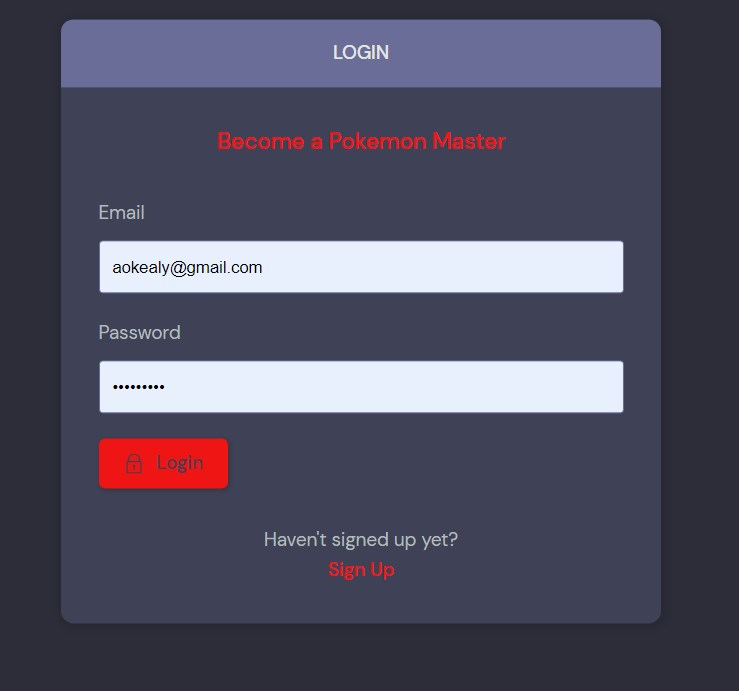

# **_The Pokemon Forum - Project Portfolio 4- Django_**

This is a Pokemon Reddit style Forum for all the Pokemon fans out there that want to interact with others in this community and create discussions but also make new friends in the Pokemon World.
This is my 4th Project that I have created.
And the Github repository can be found [here](https://github.com/aokealy/pokemon).
And the live link to website can be found [here](https://young-taiga-94207.herokuapp.com/).

# Contents

- [**Objective**](#objective)
- [**User Experience UX**](#user-experience-ux)

  - [Site Structure](#site-structure)
  - [Design Choices](#design-choices)
  - [Typography](#typography)
  - [Colour Scheme](#colour-scheme)

- [**Features**](#features)
- [**Future Features**](#future-features)
  - [Images](#images)
  - [Add-Friends](#add-friends)
- [**Technologies Used**](#technologies-used)
- [**Testing**](#testing)
- [**Bugs**](#bugs)
- [**Deployment To Heroku**](#deployment-to-heroku)
- ## [**Credits**](#credits)

# Objective

The objective was to create a reddit style forum where user's can interact by commenting on posts and viewing other people's content and pages. This project was to show your ability to use Django with databases

# User Experience (UX)

## Site Structure

The design of this website is simply to terms of accessing everything on one page to keep the user focused on the main page. The user has access to enter chat rooms where they discuss the topic they clicked on by writing a message below and seeing who is currently in the chat room.

# Features

## Existing Features

- ### Login Feature

  - This is a self made login
    feature that does not use Django own login feature.
  - You can add an email and password to it.
  - The user can also log out
  

  

- ### Update Profile
  - update user profile by adding a picture to your profile after you sign up.
  - add a bio
  - be able to change your username
  - be able to update email.
  

  
- ### Search Bar
  - a dynamic search bar where you can search even with just a letter to find any topic or post that was made on the website.
  

  
- ### Topics

  - created a topics section on the website where users will see a list of topics that are being discussed and has a more feature at the end that will show more topics that are created.
   

  

  ### Recent Activities

  - recent activities shows the latest comments that were made in a certain topic by showing the time on it.
  
  

## Design Choices

- ### Typography

  DM Sans is a low-contrast geometric sans serif design, intended for use at smaller text sizes. DM Sans supports a Latin Extended glyph set, enabling typesetting for English and other Western European languages.

- ### Colour Scheme

  --color-main: #ee1515;
   
  --color-main-light: #e1f6fb;
   
  --color-dark: #3f4156;
   
  --color-dark-medium: #51546e;
   
  --color-dark-light: #696d97;
   
  --color-light: #e5e5e5;
   
  --color-gray: #8b8b8b;
   
  --color-light-gray: #b2bdbd;
   
  --color-bg: #2d2d39;
   
  --color-success: #5dd693;
   
  --color-error: #fc4b0b;
   

  # Future Features

  - add images to messages so users can show off their pokemon cards when creating a new room.
  - add the ability for users to add friends and have a friend list.

# Technologies Used

## Languages

- [Python](<https://en.wikipedia.org/wiki/Python_(programming_language)>) - Provides the functionality for the site.
- [HTML5](https://en.wikipedia.org/wiki/HTML) - Provides the content and structure for the website.
- [CSS3](https://en.wikipedia.org/wiki/CSS) - Provides the styling for the website.
- [JavaScript](https://en.wikipedia.org/wiki/JavaScript) - Provides interactive elements of the website

## Frameworks & Software

- [Bootstrap](https://getbootstrap.com/) - A CSS framework that helps building solid, responsive, mobile-first sites
- [Django](https://www.djangoproject.com/) - A model-view-template framework used to create Pokemon Forum
- [Github](https://github.com/) - Used to host and edit the website.
- [GitBash](<https://en.wikipedia.org/wiki/Bash_(Unix_shell)>) - Terminal in [Gitpod](https://www.gitpod.io) used to push changes to the GitHub repository.
- [Heroku](https://en.wikipedia.org/wiki/Heroku) - A cloud platform that the application is deployed to.
- [Lighthouse](https://developer.chrome.com/docs/lighthouse/overview/) - Used to test performance of site.
- [Favicon](https://favicon.io/) - Used to create the favicon.
- [VSCode](https://code.visualstudio.com/) - Used to create and edit the site.
- [Google Chrome DevTools](https://developer.chrome.com/docs/devtools/) - Used to debug and test responsiveness.
- [HTML Validation](https://validator.w3.org/) - Used to validate HTML code
- [CSS Validation](https://jigsaw.w3.org/css-validator/) - Used to validate CSS code
- [PEP8 Validation](http://pep8online.com/) - At the time for deploying this project the PEP8 Online Validaton service was offline so I could not work.
- [JSHint Validation](https://jshint.com/) - Used to validate JavaScript code

# Testing

## Code Validation

The code on the 'Pokemon Forum' site has been tested through W3C Markup Validation Service, W3C CSS Validation Service and JSHint. Errors were at first found on the site in the W3C Markup Validation Service but could quite easily be fixed.

### Markup Validation

There were errors but they were coming from django tags that were used in the html files which concluded no errors from.

<b>HTML Validation Result</b>

 

### CSS Validaton

When validating my own code the W3C CSS Validator reports no errors.

<b>CSS Validation Result</b>

![CSS Result] 

 

### PEP Validation

At the time of this project the website [pep8online](http://pep8online.com/) is currently offline.

- admin.py - No errors or warnings reported
- forms.py - No errors or warnings reported
- models.py - No errors or warnings reported
- test_forms.py - No errors or warnings reported
- urls.py - No errors or warnings reported
- views.py - No errors or warnings reported

### JavaScript Validation

The JSHint validator results can be seen below:

No errors were returned when passing through JSHint (script.js) but the test reported one error for JS extension for the const.

<b>JSHint Validation Result</b>

 

### Lighthouse

<b>Lighthouse Result</b>

![Lighthouse Result]

 

# Bugs

- I have had many bugs which include not being able to create a super user which was working fine before but I cannot create one currently for some reason which I cannot fix.

- numerous issues when trying to deploy the project but I had to delete the database and migrations and remigrate them which made the site work on heroku.

- I have had many internet and computer issues over the last few weeks which was unfortunately hindered my work and is why I have a few bugs and features that I had to leave out when creating this project.

# Deployment

## Deployment To Heroku

The project was deployed to [Heroku](https://www.heroku.com). To deploy, please follow the process below:

<b>Heroku Deployment - Step 1</b>

 

2. Fill in the needed details as stated in the screenshot below and then click 'Create Repository From Template'.

<b>Heroku Deployment - Step 2</b>

 

3. When the repository creation is done click 'Gitpod'

<b>Heroku Deployment - Step 3</b>

 

4. Now it's time to install Django and the supporting libraries that are needed. Type the commands below to do this.

- `pip3 install 'django<4' gunicorn`
- `pip3 install 'dj_database_url psycopg2`
- `pip3 install 'dj3-cloudinary-storage`

<b>Heroku Deployment - Step 4</b>

 

5. When Django and the libraries are installed we need to create a requirements file.

- `pip3 freeze --local > requirements.txt` - This will create and add required libraries to requirements.txt

<b>Heroku Deployment - Step 5</b>

 

6. Now it's time to create the project.

- `django-admin startproject YOUR_PROJECT_NAME .` - This will create your project

<b>Heroku Deployment - Step 6</b>

 

7. When the project is created we can now create the application.

- `python3 manage.py startapp APP_NAME` - This will create your application

<b>Heroku Deployment - Step 7</b>

 

8. We now need to add the application to settings.py

<b>Heroku Deployment - Step 8</b>

 

8. Now it is time to do our first migration and run the server to test that everything works as expected. This is done by writing the commands below.

- `python3 manage.py migrate` - This will migrate the changes
- `python3 manage.py runserver` - This runs the server. To test it, click the open browser button that will be visible after the command is run.

9. Now it is time to create our application on Heroku, attach a database, prepare our environment and settings.py file and setup the Cloudinary storage for our static and media files.

- Head on to [Heroku](https://www.heroku.com/) and sign in (or create an account if needed).

- In the top right corner there is a button that is labeled 'New'. Click that and then select 'Create new app'.

<b>Heroku Step 09</b>

 

10. Now it's time to enter an application name that needs to be unique. When you have chosen the name, choose your region and click 'Create app".

<b>Heroku Step 10</b>

 

11. To add a database to the app you need to go to the resources tab ->> add-ons, search for 'Heroku Postgres' and add it.

<b>Heroku Step 11</b>

 

12. Go to the settings tab and click on the reveal Config Vars button. Copy the text from DATABASE_URL (because we are going to need it in the next step).

<b>Heroku Step 12</b>

 

13. Go back to GitPod and create a new env.py in the top level directory. Then add these rows.

- `import os` - This imports the os library
- `os.environ["DATABASE_URL_FROM HEROKU"]` - This sets the environment variables.
- `os.environ["SECRET_KEY"]` - Here you can choose whatever secret key you want.

<b>Heroku Step 13</b>

 

14. Now we are going to head back to Heroku to add our secret key to config vars.

<b>Heroku Step 14</b>

 

15. Now we have some preparations to do connected to our environment and settings.py file. In the settings.py, add the following code:

`import os`

`import dj_database_url`

`if os.path.isfile("env.py"):`

`import env`

<b>Heroku Step 15</b>

 

16. In the settings file, remove the insecure secret key and replace it with:
    `SECRET_KEY = os.environ.get('SECRET_KEY')`

<b>Heroku Step 16</b>

 

17. Now we need to comment out the old database setting in the settings.py file (this is because we are going to use the postgres database instead of the sqlite3 database).

<b>Heroku Step 17 1/2</b>

 

Now, add the link to the DATABASE_URL that we added to the environment file earlier.

<b>Heroku Step 17 2/2</b>

 

18. Save all your fields and migrate the changes.

`python3 manage.py migrate`

19. Now we are going to get our connection to Cloudinary connection working (this is were we will store our static files). First you need to create a Cloudinary account and from the Cloudinary dashboard copy the API Environment Variable.

20. Go back to the env.py file in Gitpod and add the Cloudinary url (it's very important that the url is correct):

`os.environ["CLOUDINARY_URL"] = "cloudinary://************************"`

21. Let's head back to Heroku and add the Cloudinary url in Config Vars. We also need to add a disable collectstatic variable to get our first deployment to Heroku to work.

<b>Heroku Step 21</b>

 

22. Let's head back to our settings.py file on Gitpod. We now need to add our Cloudinary Libraries we installed earlier to the installed apps. Here it is important to get the order correct.

<b>Heroku Step 22</b>

 

23. For Django to be able to understand how to use and where to store static files we need to add some extra rows to the settings.py file.

<b>Heroku Step 23</b>

 

24. Hang in there, we have just a couple of steps left. Now it's time to link the file to the Heroku templates directory.

<b>Heroku Step 24</b>

 

25. Let's change the templates directory to TEMPLATES_DIR in the teamplates array.

<b>Heroku Step 25</b>

 

26. To be able to get the application to work through Heroku we also need to add our Heroku app and localhost to which hosts that are allowed.

<b>Heroku Step 26</b>

 

27. Now we just need to add some files to Gitpod.

- Create 3 folders in the top level directory: **media**, **static**, **templates**
- Create a file called \*_Procfile_ and add the line `web: gunicorn PROJ_NAME.wsgi?` to it.d

28. Now you can save all the files and prepare for the first commit and push to Github by writing the lines below.

- `git add .`
- `git commit -m "Deployment Commit`
- `git push`

29. Before moving on to the Heroku deployment we just need to add one more thing in the config vars. We need to add "PORT" in the KEY input field and "8000" in the VALUE field. If we don't add this there might be problems with the deployment.

30. Now it's time for deployment. Scroll to the top of the settings page in Heroku and click the 'Deploy' tab. For deployment method, select 'Github'. Search for the repository name you want to deploy and then click connect.

31. Scroll down to the manual deployment section and click 'Deploy Branch'. Hopefully the deployment is successful!

<b>Heroku Step 31</b>

 

And the Github repository can be found [here](https://github.com/aokealy/pokemon).

# credits

I just want to say thank you to my mentor Precious.

- Youtube (https://www.youtube.com/watch?v=PtQiiknWUcI&t=1261s&ab_channel=TraversyMedia)
- Git Repository (https://github.com/divanov11/StudyBud/)
- Poke Ball Icon (https://www.pngegg.com/en/png-wnotu)
- Charizard Profile picture (https://www.forbes.com/sites/joeparlock/2021/03/29/pokmon-trading-card-game-shadowless-base-set-charizard-sells-for-over-300000/?sh=43d6f29f7e4d)
- Blastoise profile picture (https://www.pokemon.com/us/pokedex/blastoise)
