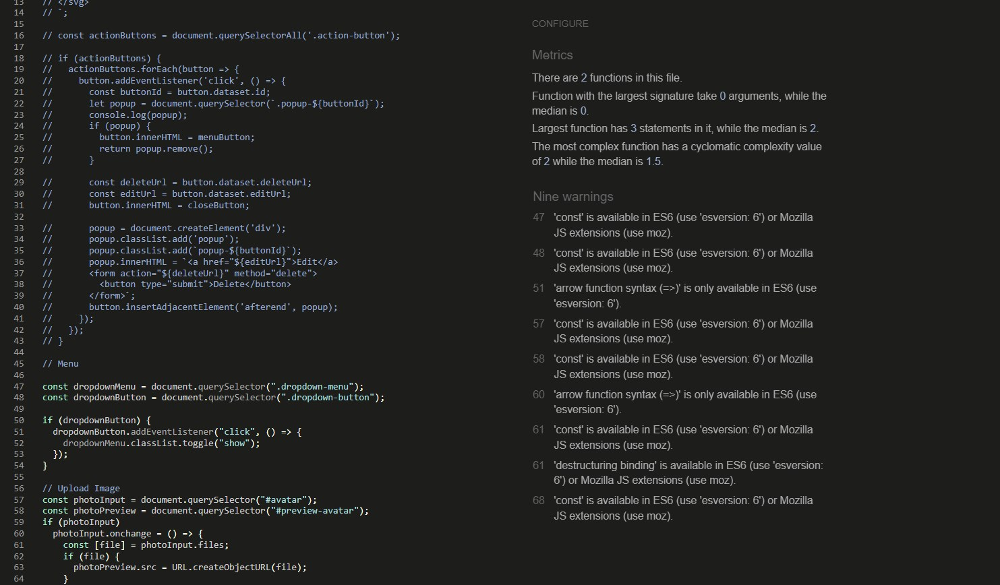

# **_The Pokemon Forum - Project Portfolio 4- Django_**

This is a Pokemon Reddit style Forum for all the Pokemon fans out there that want to interact with others in this community and create discussions but also make new friends in the Pokemon World.
This is my 4th Project that I have created.

# Contents

- [**Objective**](#objective)
- [**User Experience UX**](#user-experience-ux)

  - [Site Structure](#site-structure)
  - [Design Choices](#design-choices)
  - [Typography](#typography)
  - [Colour Scheme](#colour-scheme)

- [**Features**](#features)
- [**Future Features**](#future-features)
  - [Images](#images)
  - [Add-Friends](#add-friends)
- [**Technologies Used**](#technologies-used)
- [**Python Packages**](#python-packages)
- [**Testing**](#testing)
- [**Deployment To Heroku**](#deployment-to-heroku)
- [**Credits**](#credits)
  - [**Content**](#content)
  - [**Media**](#media)
  - [**Code**](#code)
- [**Acknowledgments**](#acknowledgements)
- [**Personal Development**](#personal-development)

# Objective

The objective was to create a reddit style forum where user's can interact by commenting on posts and viewing other people's content and pages. This project was to show your ability to use Django with databases

# User Experience (UX)

## Site Structure

The design of this website is simply to terms of accessing everything on one page to keep the user focused on the main page.

# Features

## Existing Features

- ### Login Feature

  - This is a self made login
    feature that does not use Django own login feature.
  - You can add an email and password to it.
  - The user can also log out
  

  

- ### Update Profile
  - update user profile by adding a picture to your profile after you sign up.
  - add a bio
  - be able to change your username
  - be able to update email.
  

  
- ### Search Bar
  - a dynamic search bar where you can search even with just a letter to find any topic or post that was made on the website.
  

  
- ### Topics

  - created a topics section on the website where users will see a list of topics that are being discussed and has a more feature at the end that will show more topics that are created.
   

  

  ### Recent Activities

  - recent activities shows the latest comments that were made in a certain topic by showing the time on it.
  
  

## Design Choices

- ### Typography

  DM Sans is a low-contrast geometric sans serif design, intended for use at smaller text sizes. DM Sans supports a Latin Extended glyph set, enabling typesetting for English and other Western European languages.

- ### Colour Scheme

  --color-main: #ee1515;
   
  --color-main-light: #e1f6fb;
   
  --color-dark: #3f4156;
   
  --color-dark-medium: #51546e;
   
  --color-dark-light: #696d97;
   
  --color-light: #e5e5e5;
   
  --color-gray: #8b8b8b;
   
  --color-light-gray: #b2bdbd;
   
  --color-bg: #2d2d39;
   
  --color-success: #5dd693;
   
  --color-error: #fc4b0b;
   

  # Future Features

  - add images to messages so users can show off their pokemon cards when creating a new room.
  - add the ability for users to add friends and have a friend list.

# Technologies Used

## Languages

- [Python](<https://en.wikipedia.org/wiki/Python_(programming_language)>) - Provides the functionality for the site.
- [HTML5](https://en.wikipedia.org/wiki/HTML) - Provides the content and structure for the website.
- [CSS3](https://en.wikipedia.org/wiki/CSS) - Provides the styling for the website.
- [JavaScript](https://en.wikipedia.org/wiki/JavaScript) - Provides interactive elements of the website

## Frameworks & Software

- [Bootstrap](https://getbootstrap.com/) - A CSS framework that helps building solid, responsive, mobile-first sites
- [Django](https://www.djangoproject.com/) - A model-view-template framework used to create Pokemon Forum
- [Github](https://github.com/) - Used to host and edit the website.
- [GitBash](<https://en.wikipedia.org/wiki/Bash_(Unix_shell)>) - Terminal in [Gitpod](https://www.gitpod.io) used to push changes to the GitHub repository.
- [Heroku](https://en.wikipedia.org/wiki/Heroku) - A cloud platform that the application is deployed to.
- [Lighthouse](https://developer.chrome.com/docs/lighthouse/overview/) - Used to test performance of site.
- [Favicon](https://favicon.io/) - Used to create the favicon.
- [VSCode](https://code.visualstudio.com/) - Used to create and edit the site.
- [Google Chrome DevTools](https://developer.chrome.com/docs/devtools/) - Used to debug and test responsiveness.
- [HTML Validation](https://validator.w3.org/) - Used to validate HTML code
- [CSS Validation](https://jigsaw.w3.org/css-validator/) - Used to validate CSS code
- [PEP8 Validation](http://pep8online.com/) - At the time for deploying this project the PEP8 Online Validaton service was offline so I could not work.
- [JSHint Validation](https://jshint.com/) - Used to validate JavaScript code

# Testing

## Code Validation

The code on the 'Pokemon Forum' site has been tested through W3C Markup Validation Service, W3C CSS Validation Service and JSHint. Errors were at first found on the site in the W3C Markup Validation Service but could quite easily be fixed.

### Markup Validation

There were errors but they were coming from django tags that were used in the html files which concluded no errors from.

<b>HTML Validation Result</b>

 

[Back to top](#table-of-content)

### CSS Validaton

When validating my own code the W3C CSS Validator reports no errors.

<b>CSS Validation Result</b>

![CSS Result] 

 

[Back to top](#table-of-content)

### PEP Validation

At the time of this project the website [pep8online](http://pep8online.com/) is currently offline.

- admin.py - No errors or warnings reported
- forms.py - No errors or warnings reported
- models.py - No errors or warnings reported
- test_forms.py - No errors or warnings reported
- urls.py - No errors or warnings reported
- views.py - No errors or warnings reported

[Back to top](#table-of-content)

### JavaScript Validation

The JSHint validator results can be seen below:

No errors were returned when passing through JSHint (script.js) but the test reported one error for JS extension for the const.

<b>JSHint Validation Result</b>

 

[Back to top](#table-of-content)

### Lighthouse

<b>Lighthouse Result</b>

![Lighthouse Result]

 

# credits

- Youtube (https://www.youtube.com/watch?v=PtQiiknWUcI&t=1261s&ab_channel=TraversyMedia)
